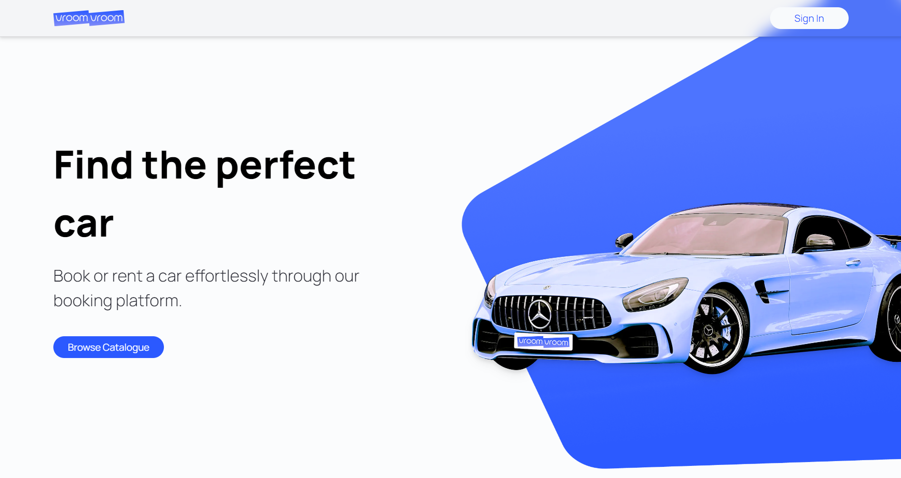

# VroomVroom

VroomVroom is your go-to car booking app for effortless car rentals. With VroomVroom, you can search through a vast API of cars by fuel type, make, and model, ensuring you find the perfect car for any occasion. Whether you're looking for electric or gas, manual or automatic, we got you covered. From top brands to classic models, our app offers a diverse selection to match your style. With VroomVroom, your dream car is just a click away!

## 🏅 Acknowledgments

Based on [JavaScript Mastery's tutorial](https://www.youtube.com/watch?v=pUNSHPyVryU). Thank you!

🔗 [See it live!](...)

## ⚙️ Tech

 
 
 

